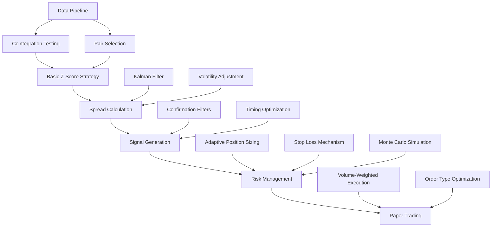

# Implementation Dependency Graph

This document outlines the dependencies between system components to ensure proper implementation order and prevent circular dependencies.

## Core Component Dependencies

## Component Dependencies Details

### Data Pipeline
- **Depends on**: None (foundation component)
- **Required by**: Cointegration Testing, Pair Selection
- **Status**: Implemented
- **Implementation Order**: First

### Cointegration Testing
- **Depends on**: Data Pipeline
- **Required by**: Basic Z-Score Strategy
- **Status**: Partially Implemented
- **Missing Components**: Johansen test, rolling window analysis, out-of-sample validation
- **Implementation Order**: Second

### Pair Selection
- **Depends on**: Data Pipeline
- **Required by**: Basic Z-Score Strategy
- **Status**: Partially Implemented
- **Missing Components**: Complete filtering criteria, correlation validation
- **Implementation Order**: Second

### Basic Z-Score Strategy
- **Depends on**: Cointegration Testing, Pair Selection
- **Required by**: Spread Calculation
- **Status**: Not Implemented
- **Implementation Order**: Third

### Spread Calculation
- **Depends on**: Basic Z-Score Strategy
- **Required by**: Signal Generation
- **Status**: Partially Implemented
- **Missing Components**: Kalman filter, volatility adjustment
- **Implementation Order**: Fourth

### Signal Generation
- **Depends on**: Spread Calculation
- **Required by**: Risk Management
- **Status**: Partially Implemented
- **Missing Components**: Confirmation filters, timing optimization
- **Implementation Order**: Fifth

### Risk Management
- **Depends on**: Signal Generation
- **Required by**: Paper Trading
- **Status**: Not Implemented
- **Missing Components**: Adaptive position sizing, stop loss, Monte Carlo simulation
- **Implementation Order**: Sixth

### Paper Trading
- **Depends on**: Risk Management
- **Required by**: None (final component in critical path)
- **Status**: Prematurely Attempted (missing dependencies)
- **Implementation Order**: Seventh

## Critical Path Analysis

The critical path for implementation is:

1. Data Pipeline
2. Cointegration Testing & Pair Selection
3. Basic Z-Score Strategy
4. Spread Calculation (with Kalman Filter)
5. Signal Generation (with Confirmation Filters)
6. Risk Management (with Position Sizing)
7. Paper Trading

## Current Blockers

1. **Missing Critical Dependencies**:
   - Risk Management implementation is missing completely but required for Paper Trading
   - Kalman Filter implementation is missing but required for robust Spread Calculation

2. **Incomplete Implementations**:
   - Cointegration Testing lacks Johansen test and out-of-sample validation
   - Signal Generation lacks confirmation filters

3. **Phase Sequencing Issues**:
   - Paper Trading attempted before Risk Management implementation
   - Advanced features attempted before core components completed

## Implementation Priority Recommendations

Given the current state and dependencies, the implementation priorities should be:

1. **Immediate Priority** (Current Sprint):
   - Complete Cointegration Testing with Johansen test
   - Implement Basic Z-Score Strategy fully
   - Begin Kalman Filter implementation

2. **Next Priority** (Next Sprint):
   - Complete Spread Calculation with Kalman Filter
   - Complete Signal Generation with Confirmation Filters 
   - Begin Risk Management implementation

3. **Future Priority** (Future Sprints):
   - Complete Risk Management with all components
   - Resume Paper Trading with all dependencies satisfied 